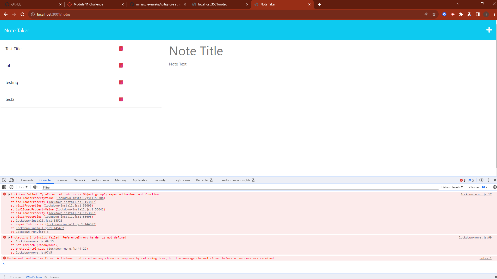
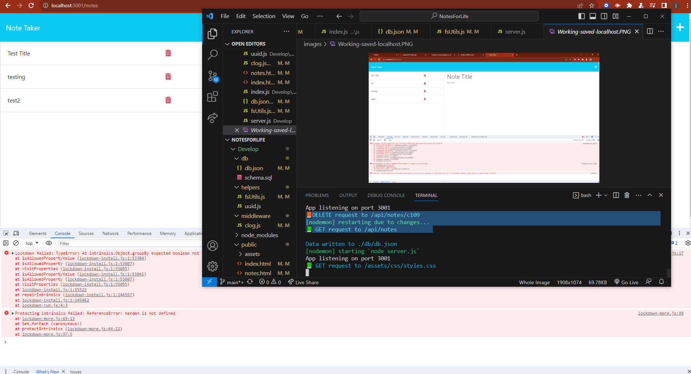
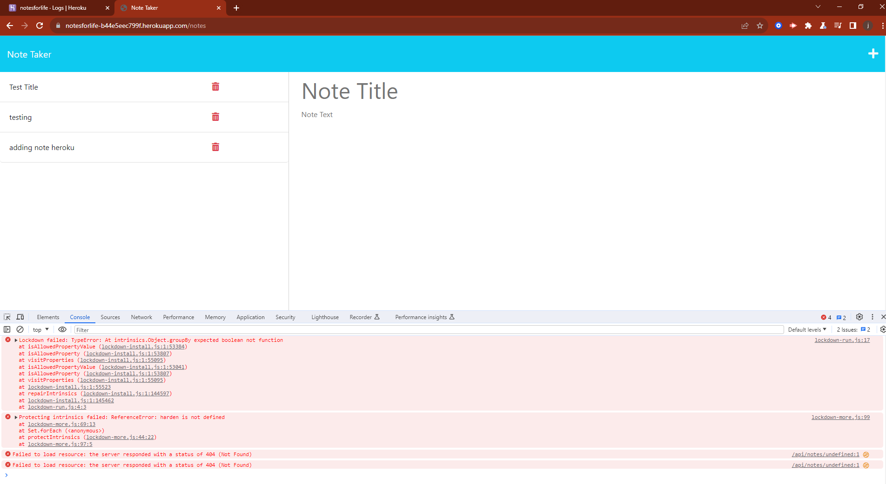
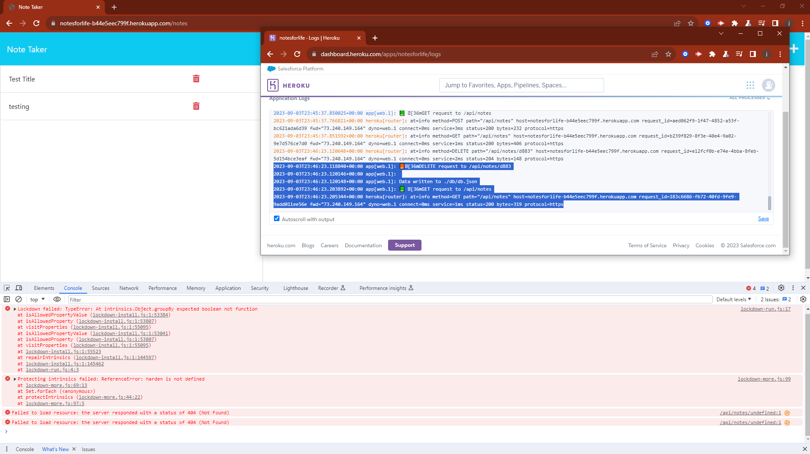

<h1 align="center">NotesforLife</h1>

<h2 align="center">Description</h2>

**Notes for Life** is a challenge to complete the backend of a note-taking application. It involves the task of establishing routes and seamlessly connecting them with the frontend components, which presented a set of intriguing challenges for me. It began with some hurdles, such as identifying missing parts and effectively implementing them. Initially, the routes were puzzling, but after I got the first one, the others fell into place. I also faced some challenges using the starter code, which taught me a valuable lesson about variable names. The challenge was undeniably rewarding, especially when I saw the website live on Heroku, and I was able to create and delete posts.

## Table of Contents

- [Installation](#installation)
- [Usage](#usage)
- [Credits](#credits)
- [License](#license)

<h2 align="center">Installation</h2>

**Steps Required:**
You can view **NotesforLife** online at the deployed link or clone the repository, install the necessary packages, and run it on localhost using port 3000.

<h2 align="center">Photos</h2>

<h2 align="center">Usage</h2>

**NotesforLife** lets users create notes, organize their thoughts, and delete them when they are complete or save them for future reference.

<h2 align="center">Credits</h2>

Starter code cloned from [GitHub - Miniature Eureka](https://github.com/coding-boot-camp/miniature-eureka).

<h2 align="center">License</h2>

Refer to the repository for licensing information. This project is under the MIT License.

<h2 align="center">Badges</h2>

<h2 align="center">Features</h2>

**NotesforLife** allows users to create, view, and delete notes.

<h2 align="center">How to Contribute</h2>

You can contribute by adding notes, and any suggestions can be submitted through a pull request with the specified changes.

<h2 align="center">Questions</h2>

You can reach my GitHub profile at [dupeaj](https://github.com/dupeaj). If you have additional questions, please feel free to reach me at jacobsemail@gmail.com.

